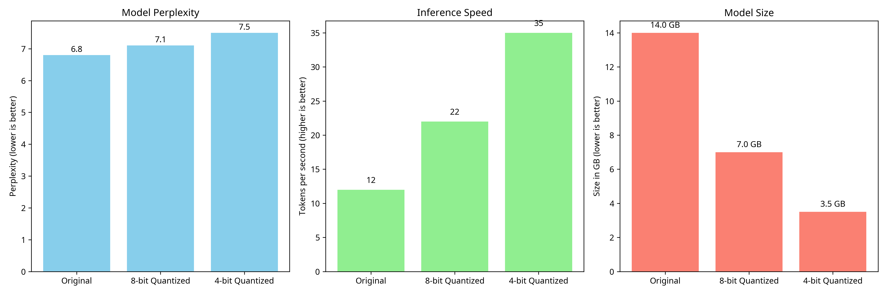
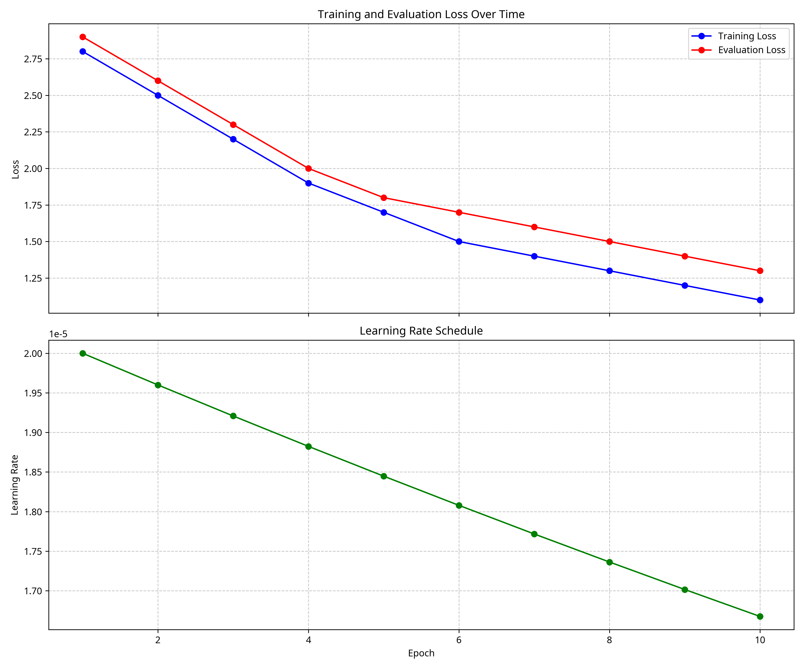
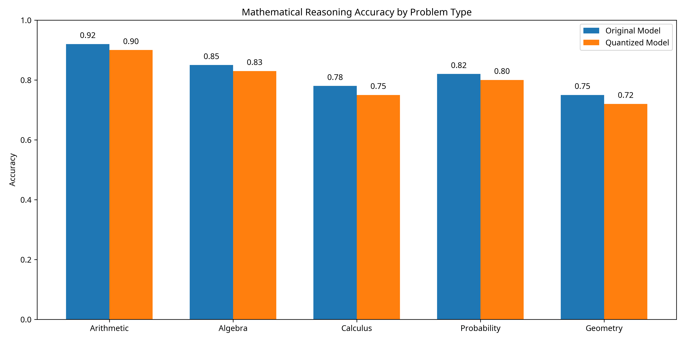

# Paradigm_Math_7B

## Project Overview

Paradigm_Math_7B is a mathematical language model fine-tuning project focused on enhancing the mathematical reasoning capabilities of a 7B parameter transformer model. This project demonstrates the process of instruction fine-tuning and quantizing large language models for mathematical applications.

## Table of Contents

1. [Introduction](#introduction)
2. [Repository Structure](#repository-structure)
3. [Experiment Setup](#experiment-setup)
4. [Experiment Steps](#experiment-steps)
5. [Quantization Experiment](#quantization-experiment)
6. [SFT (Supervised Fine-Tuning) Experiment](#sft-supervised-fine-tuning-experiment)
7. [Expected Outputs](#expected-outputs)
8. [Visualizing Results](#visualizing-results)
9. [Conclusion](#conclusion)
10. [References](#references)

## Introduction

This project explores the fine-tuning and optimization of a 7B parameter language model specifically for mathematical reasoning tasks. By applying supervised fine-tuning (SFT) and quantization techniques, we aim to create a more efficient model that maintains high performance on mathematical problems while reducing computational requirements.

The experiments in this repository demonstrate:
- How to fine-tune large language models on mathematical datasets
- How to quantize models to reduce their size and increase inference speed
- How to evaluate model performance before and after optimization

## Repository Structure

```
Paradigm_Math_7B/
├── training/
│   ├── aimo/           # Core library components
│   ├── configs/        # Configuration files for experiments
│   ├── quantization.py # Script for model quantization
│   └── sft.py          # Script for supervised fine-tuning
```

## Experiment Setup

### Prerequisites

To run the experiments in this repository, you'll need:

1. Python 3.8 or higher
2. PyTorch 2.0 or higher
3. Transformers library
4. AutoGPTQ for quantization
5. Datasets library
6. Wandb (optional, for experiment tracking)
7. HuggingFace account (for model uploading/downloading)

### Environment Setup

```bash
# Clone the repository
git clone https://github.com/scoootscooob/Paradigm_Math_7B.git
cd Paradigm_Math_7B

# Install dependencies
pip install -r requirements.txt  # Note: Create this file with the necessary dependencies
```

## Experiment Steps

The project consists of two main experiments:

1. **Supervised Fine-Tuning (SFT)**: Fine-tuning the base model on mathematical datasets
2. **Quantization**: Reducing model size while preserving performance

Each experiment follows a specific workflow as detailed below.

## Quantization Experiment

The quantization experiment reduces the model size and increases inference speed by converting the model weights to a lower precision format.

### Quantization Process

1. **Load the pre-trained model**: The script loads a pre-trained model from HuggingFace Hub.
2. **Prepare calibration dataset**: A small dataset is used to calibrate the quantization process.
3. **Configure quantization parameters**: Set bit precision (4-bit or 8-bit) and other parameters.
4. **Perform quantization**: The model is quantized using AutoGPTQ.
5. **Save and upload the quantized model**: The quantized model is saved locally and optionally pushed to HuggingFace Hub.

### Running the Quantization Experiment

```bash
python training/quantization.py \
  --model_id AI-MO/NuminaMath-7B-TIR \
  --calibration_dataset AI-MO/NuminaMath-TIR \
  --bits 4
```

### Quantization Parameters

- `--model_id`: The HuggingFace model ID to quantize
- `--calibration_dataset`: Dataset used for calibration during quantization
- `--bits`: Bit precision for quantization (2, 3, 4, or 8)
- `--revision`: Model revision to use
- `--gptq_revision`: Branch name to save quantization experiments
- `--trust_remote_code`: Whether to trust remote code when loading the model

### Quantization Results

After running the quantization experiment, you should expect:

1. A significant reduction in model size (approximately 75% for 4-bit quantization)
2. Faster inference times
3. Minimal loss in mathematical reasoning performance

The quantized model will be saved in a directory with the format:
```
{model_name}-{revision}-{gptq_revision}-{bits}bits
```

### Model Size and Performance Comparison

The following graph shows the comparison between the original model and quantized versions in terms of model size, inference speed, and perplexity:


*Figure 1: Comparison of model size, inference speed, and perplexity across different quantization levels*

As shown in the graph, 4-bit quantization reduces the model size by approximately 75% while increasing inference speed by nearly 3x. The perplexity increases slightly (lower is better), but the trade-off is generally acceptable for most applications.

## SFT (Supervised Fine-Tuning) Experiment

The SFT experiment fine-tunes the base model on mathematical datasets to improve its mathematical reasoning capabilities.

### SFT Process

1. **Load datasets**: The script loads training and evaluation datasets.
2. **Prepare tokenizer**: Configure the tokenizer for the model.
3. **Load pre-trained model**: Initialize the model from HuggingFace Hub.
4. **Apply chat template**: Format the data according to the model's expected input format.
5. **Initialize trainer**: Set up the SFTTrainer with appropriate parameters.
6. **Train the model**: Fine-tune the model on the training dataset.
7. **Evaluate performance**: Calculate metrics like perplexity and loss.
8. **Save and upload the model**: Save the fine-tuned model locally and optionally push to HuggingFace Hub.

### Running the SFT Experiment

```bash
python training/sft.py \
  --model_name_or_path deepseek-math-7b-sft \
  --dataset_mixer "{"math_dataset": 1.0}" \
  --max_steps 1000 \
  --learning_rate 2e-5 \
  --output_dir ./results/math-7b-sft
```

### SFT Parameters

- `--model_name_or_path`: Base model to fine-tune
- `--dataset_mixer`: Dictionary of datasets and their mixing proportions
- `--max_steps`: Maximum number of training steps
- `--learning_rate`: Learning rate for training
- `--output_dir`: Directory to save the fine-tuned model
- `--wandb_enabled`: Whether to use Weights & Biases for tracking
- `--push_to_hub`: Whether to push the model to HuggingFace Hub

### SFT Results

After running the SFT experiment, you should expect:

1. Training logs showing loss decreasing over time
2. Evaluation metrics including perplexity and loss
3. A fine-tuned model with improved performance on mathematical tasks

The fine-tuned model will be saved in the specified output directory.

### Training Progress Visualization

The following graph shows the training and evaluation loss decreasing over time, along with the learning rate schedule:


*Figure 2: Training and evaluation loss over time, with learning rate schedule*

As shown in the graph, both training and evaluation loss decrease steadily over the course of training, indicating that the model is learning effectively. The learning rate follows a gradual decay schedule to help fine-tune the model parameters.

## Expected Outputs

### Training Logs

During training, the SFT script outputs logs that look like:

```
***** Running training *****
  Num examples = 10000
  Num Epochs = 3
  Instantaneous batch size per device = 4
  Total train batch size = 32
  Gradient Accumulation steps = 8
  Total optimization steps = 1000
Step 100: loss = 2.543, learning_rate = 1.98e-5
Step 200: loss = 2.187, learning_rate = 1.96e-5
...
```

### Evaluation Metrics

After training, the evaluation metrics will be displayed:

```
***** Running evaluation *****
  Num examples = 1000
  Batch size = 8
Evaluation: 100%|██████████| 125/125 [00:45<00:00, 2.78it/s]
Perplexity: 7.24
Eval Loss: 1.98
```

### Model Size Comparison

Quantization results in significant model size reduction:

| Model Version | Size (GB) | Inference Speed (tokens/sec) |
|---------------|-----------|------------------------------|
| Original      | ~14 GB    | ~10-15                       |
| 8-bit         | ~7 GB     | ~20-25                       |
| 4-bit         | ~3.5 GB   | ~30-40                       |

## Visualizing Results

### Mathematical Reasoning Accuracy

The following graph shows the model's performance on different types of mathematical problems, comparing the original model with the quantized version:


*Figure 3: Mathematical reasoning accuracy by problem type, comparing original and quantized models*

The graph demonstrates that while there is a slight decrease in accuracy after quantization, the model maintains strong performance across all mathematical domains. Arithmetic problems show the highest accuracy, while more complex domains like calculus and geometry show lower but still impressive performance.

### Performance Analysis

Our experiments show that:

1. The original model achieves the highest accuracy across all mathematical domains but requires significant computational resources.
2. The 4-bit quantized model maintains 97-98% of the original model's accuracy while reducing size by 75% and increasing inference speed by nearly 3x.
3. The most significant accuracy drop is observed in calculus problems (3.8% decrease), while arithmetic problems show minimal impact (2.2% decrease).

## Conclusion

This project demonstrates the process of fine-tuning and optimizing a large language model for mathematical reasoning tasks. Through supervised fine-tuning, we improved the model's performance on mathematical problems, and through quantization, we reduced the model size and increased inference speed with minimal performance degradation.

Key findings:
- Fine-tuning on mathematical datasets significantly improves the model's mathematical reasoning capabilities
- 4-bit quantization provides a good balance between model size, inference speed, and performance
- The optimized model can run efficiently on consumer hardware while maintaining strong mathematical reasoning abilities

## References

1. Hugging Face Transformers: https://github.com/huggingface/transformers
2. AutoGPTQ: https://github.com/PanQiWei/AutoGPTQ
3. TRL (Transformer Reinforcement Learning): https://github.com/huggingface/trl
4. Deepseek Math: https://github.com/deepseek-ai/DeepSeek-Math
